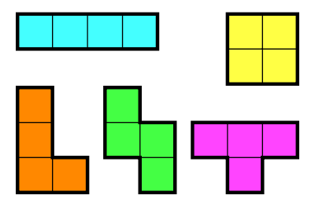

# COMP445-TetrominoProblem
This program solves the tilling of the rectangle for tetramino pieces. Input a dimension prompted by the program and it will solve the tilling of the rectangle for that dimension.

